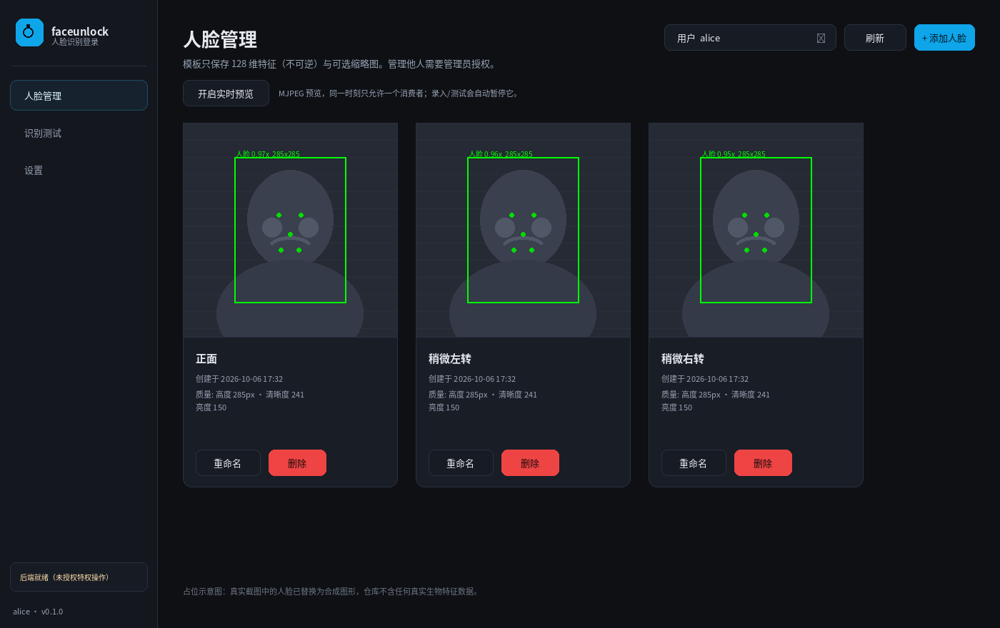
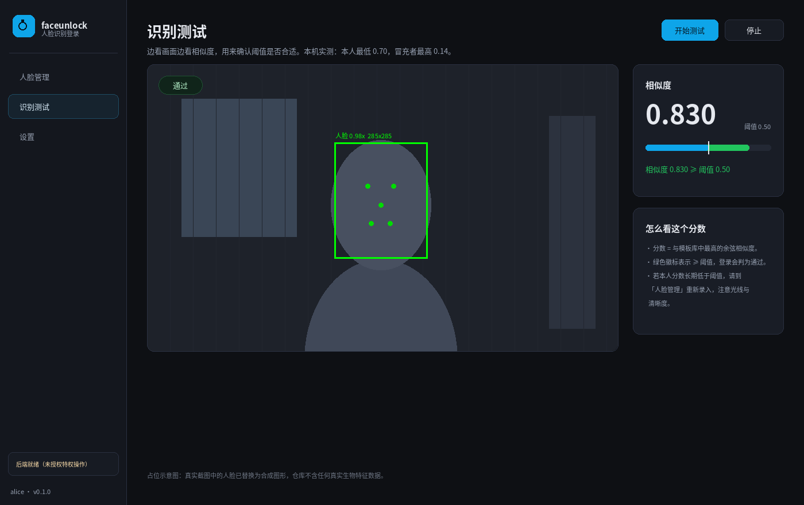

# faceunlock

> 给 Ubuntu / GNOME 加一套**人脸识别登录**：开机登录界面、锁屏、`sudo`、`su`、`pkexec` 授权框，全部覆盖。
>
> 一个 PAM 模块 + 一个特权助手 + 一个 Tauri 管理界面 + 一套 31 项验收测试。

[](#已验证环境)
[-blueviolet)](#它覆盖哪些场景)
[-blue)](#它是怎么工作的)
[](#验收与实测结果)
[](#许可证)

**语言**：中文（英文版欢迎 PR，见 [参与贡献](#参与贡献)）

---

## ⚠️ 先读这一段：这是便捷因子，不是密码的替代品

本机是**纯 RGB 摄像头（无红外）**，因此**没有硬件级活体检测**。

实测：把一张照片缩到人脸 90px、加高斯模糊、JPEG 压到质量 45 之后，
5 张测试图里仍有 **3 张**的相似度落在 0.61~0.73，**远高于 0.40 的登录阈值，会被放行**。
也就是说——**拿一张你的照片对着摄像头，是可能解锁的。**

因此本项目的设计前提是：

- 密码永远保留，人脸只是「可以少打几次密码」；
- 任何异常（没检测到脸 / 摄像头被占用 / 超时 / 远程 SSH / 模板损坏 / 代码抛异常）
  都**回退到密码**，绝不把你锁在系统外；
- 高价值目标（服务器 root、加密盘、网银）请勿依赖它。

想要真正防照片，需要红外摄像头（Windows Hello 那类）或在软件里加活体挑战。
本项目按「便利优先」取舍。详见 [安全设计](#安全设计) 与 [已知弱点](#已知弱点)。

---

## 界面

| 人脸管理 | 识别测试 |
|---|---|
|  |  |

> 截图中的用户名为占位符，人脸为测试用示例。仓库不含任何真实人脸数据，见 [PRIVACY.md](PRIVACY.md)。

---

## 它覆盖哪些场景

| 场景 | PAM 服务 | 说明 |
|---|---|---|
| 开机登录界面 | `gdm-password` | 在 GDM 里选中用户后自动开始找人脸 |
| GNOME 锁屏解锁 | `gdm-password` | 同一个服务，gnome-shell 通过 GDM D-Bus 走这条栈 |
| `sudo` / `sudo -i` | `sudo` / `sudo-i` | 终端里执行时先找人脸，失败才提示 `Password:` |
| `su` | `su` | 同上 |
| 图形界面管理员弹窗 | `polkit-1` | `pkexec`、软件中心装包等触发的授权框 |
| 控制台 TTY | `login` | 默认**关闭**（可在配置里打开） |

管理界面（Tauri 桌面窗口）可以：查看 / 新增 / 重命名 / 删除人脸、实时预览并显示检测框、
做一次真实识别测试看相似度分数、调阈值、按场景开关、一键停用。

---

## 快速开始

```bash
# 1) 准备依赖（模型 + 随包 OpenCV，见下节「获取依赖」）
./scripts/fetch-deps.sh

# 2) 编译 PAM 模块
make            # 等价于 gcc -shared -fPIC -O2 -Wall -Wextra -o pam/pam_faceunlock.so ...

# 3) 打 deb（需要 build-essential / debhelper / libpam0g-dev）
dpkg-buildpackage -b -us -uc

# 4) 安装（图省事装完整包）
sudo apt install ../faceunlock-full_0.1.0_amd64.deb

# 5) 自检 → 录入 → 打靶测试（这一步不改任何系统配置）
sudo faceunlock doctor
sudo faceunlock enroll "$USER"
sudo faceunlock test   "$USER"

# 6) 确认没问题后再接入 PAM
#    ★ 强烈建议：先按 Ctrl+Alt+F3 开一个 root 终端留在那里，再执行下面这条
sudo faceunlock enable
```

### 三个包的关系

| 包 | 大小 | 内容 | 说明 |
|---|---|---|---|
| `faceunlock` | 66 MB | PAM 模块、root 助手、CLI、模型、随包 OpenCV | 核心，必需 |
| `faceunlock-gui` | 1.9 MB | Tauri 桌面窗口、图标、桌面项 | 依赖核心包；需要 WebKit 依赖 |
| `faceunlock-full` | 68 MB | **上面两个的并集** | 自包含，一个包装完 |

`faceunlock-full` 声明了 `Conflicts/Replaces/Provides: faceunlock, faceunlock-gui`，
所以**同一时刻只能装其中一套**。切换用 `apt`（它会自动处理冲突）：

```bash
sudo apt install ./faceunlock-full_0.1.0_amd64.deb                              # 拆 → 合
sudo apt install ./faceunlock_0.1.0_amd64.deb ./faceunlock-gui_0.1.0_amd64.deb  # 合 → 拆
```

**切换不会丢东西**：人脸模板（`/var/lib/faceunlock`）、配置、以及「人脸是否已启用」
都会被保留。后者靠一个 `/run` 里的临时标记：旧包的 `prerm` 在摘掉 PAM 引用前记下状态，
新包的 `postinst` 看到标记就用 `faceunlock enable --robust` 恢复。

> 为什么是 `--robust`：实测 `apt install` 的事务顺序是
> `prerm(摘引用) → unpack → postinst(恢复) → dpkg trigger(pam-auth-update 重写托管区)`，
> trigger 最后跑，会把写进托管区的行按（已被清空的）debconf 状态重新生成掉，
> 导致人脸认证静默失效。`--robust` 把我们的行写到 pam-auth-update 的**托管区之外**
> ——它只重写自己那一块，托管区之前的内容会原样保留。
> 这一点已用「来回切换 + 强制 `pam-auth-update --package`」实测验证。

装包本身**不会**改变你的登录方式——PAM profile 是 `Default: no`，
只有换包时的状态恢复、或你显式执行 `faceunlock enable`，才会写进 `/etc/pam.d/common-auth`。

### 获取依赖

仓库为保持轻量，**不包含**以下大体积内容（见 [.gitignore](.gitignore)）：

| 内容 | 体积 | 获取方式 |
|---|---|---|
| `models/*.onnx` | 38 MB | [opencv_zoo](https://github.com/opencv/opencv_zoo)：`face_detection_yunet_2023mar.onnx`、`face_recognition_sface_2021dec.onnx` |
| `vendor/` | 127 MB | `pip download opencv-python-headless==4.11.0.86` 后解包 wheel 到 `vendor/` |

> ⚠️ opencv_zoo 的模型是 **git-LFS** 指针，`raw.githubusercontent.com` 拿到的是
> 131 字节的指针文件。真实内容要用 `media.githubusercontent.com/media/...`。
> 打包脚本已对 0 字节/指针文件做拦截（`packaging/install-tree.sh`）。

---

## 使用

```bash
faceunlock doctor              # 系统自检（摄像头/模型/模板库/PAM/配置）
faceunlock status              # 当前状态、已录入用户、场景开关
faceunlock users               # 列出系统用户及其录入情况
faceunlock list  <用户>        # 列出某用户的人脸（含 id）
sudo faceunlock enroll <用户> --label 正面 --samples 5
sudo faceunlock rename <用户> --id <id> --label 新名字
sudo faceunlock delete <用户> <id>        # id 传 all 表示清空
faceunlock test   <用户>       # 跑一次真实识别，打印相似度
sudo faceunlock threshold 0.55 # 调阈值
sudo faceunlock service sudo off   # 单独关掉某个场景
sudo faceunlock enable|disable|panic
```

`panic` 是**一键还原**：把人脸从 PAM 栈里摘掉 + 关掉总开关。
万一出现任何异常导致登录不顺利，进 root 终端执行它即可立刻回到纯密码。

### 图形界面

装了 `faceunlock-gui` 之后，在应用列表里搜「人脸识别管理」，或直接运行：

```bash
faceunlock-gui
```

| 标签页 | 内容 |
|---|---|
| **人脸管理** | 用户选择器；人脸卡片（缩略图 / 标签 / 创建时间）；新增（实时预览、检测框、采集进度、姿态提示）、重命名、删除 |
| **识别测试** | 实时画面 + 相似度分数条 + 阈值参考线 + 通过/不通过徽标，用来直观判断阈值是否合适 |
| **设置** | 总开关；场景开关（登录+锁屏 / sudo / su / pkexec）；阈值滑块；一键停用（panic）；自检结果表 |

**首次执行写操作（添加/删除人脸、改设置）时会弹出系统密码授权框**——
这是刻意的：模板库是 `root:root 0700`，普通用户进程不能直接写。
授权走 polkit 动作 `org.faceunlock.manage`，授权后 5 分钟内不再重复询问。

界面本身**始终以普通用户身份运行**，不持有 root 权限，前端也拿不到 root 能力；
它把请求转给 `pkexec` 拉起的 `faceunlock-admin`，后者用 `PKEXEC_UID` 反查调用者身份，
再决定「你能管谁」。接口契约见 [`docs/GUI_API.md`](docs/GUI_API.md)。

---

## 它是怎么工作的

```
GDM 登录界面 / GNOME 锁屏
      │  gnome-shell（libshell-14.so 内含 org.gnome.DisplayManager 客户端，
      │  服务名写死为 gdm-password）经 GDM 的 D-Bus reauth 通道发起
      ▼
gdm-session-worker (root, 服务名 gdm-password)
      │
      sudo / su / pkexec ──┐
      │              │
      ▼              ▼
  /etc/pam.d/*  ── @include ──▶ /etc/pam.d/common-auth
                                     │
                    auth sufficient  pam_faceunlock.so      ← 我们插在这里，第一位
                    auth [success=2] pam_unix.so nullok     ← 原来的密码认证
                    ...
                                     │
                                     ▼
                     /usr/libexec/faceunlock-auth  (root 一次性进程)
                        · 打开 /dev/video0（root 直接可读，不需要 video 组）
                        · YuNet 检测 → 取最大人脸 → SFace 对齐 → 128 维特征
                        · 与「该 PAM_USER 自己的」模板算余弦相似度
                        · 多帧投票（默认 3 帧里中 2 帧）
                        · 限速：5 次失败 / 5 分钟 → 冷却 2 分钟
                        · 退出码 0=匹配 1=不匹配 2=不适用
                                     │
                                     ▼
                     /var/lib/faceunlock/  (root 0700，模板 0600 + HMAC 签名)
```

识别推理跑在 **root 一次性进程**里，用完立刻释放摄像头——
不会出现「后台常驻占着摄像头，视频会议打不开」的问题。

### 信任边界

```
  普通用户前端 (Tauri webview)
        │  仅持有一次性 token
        ▼
  faceunlock-gui-bridge   ← 普通用户身份；127.0.0.1 随机端口 + Host 校验 + token
        │  JSON-Lines over stdio
        ▼
  pkexec ──▶ faceunlock-admin (root)   ← 唯一能写模板库 / 改 PAM 的进程
        │      用 PKEXEC_UID 反查真实调用者，决定「你能管谁」
        ▼
  /var/lib/faceunlock (root 0700)  ·  /etc/pam.d (root)
```

前端**拿不到** root 能力，只能请求；跨过 polkit 授权后 admin 才动手。

---

## 安全设计

| 机制 | 为什么 |
|---|---|
| 控制位用 `sufficient`，**绝不用 `required`** | 摄像头坏了不能连密码一起挡掉 |
| 失败/异常一律映射到 `PAM_IGNORE` | 未录入、无摄像头、被占用、超时、远程会话、模板被篡改、代码抛异常——全部回退密码 |
| C 模块带 `alarm()` 硬超时并 `SIGKILL` 子进程 | 摄像头驱动卡死时不能把所有人卡在登录界面 |
| 身份只取 `PAM_USER` | 绝不读 `USER`/`LOGNAME` 环境变量（那是可伪造的） |
| `PAM_RHOST` 非空直接跳过 | 否则 SSH 登录会被「坐在电脑前的人」认证掉 |
| 助手 shebang 用绝对路径 | libpam 直接 execv，不经过 shell，PATH 不可依赖 |
| 模板只存 128 维特征，不存原图 | 生物特征最小化；缩略图可选关 |
| 模板文件 HMAC-SHA256 签名，root 0600 | 改模板 == 决定谁能解锁该账户，属提权路径 |
| 校验失败**拒绝使用**该模板（而不是放行） | 失败要往安全侧倒 |
| 服务白名单 | 只有配置里列出的 PAM 服务才生效，`cron`/`cups` 之类不会被牵连 |
| 普通用户只能管理自己的人脸 | 管理他人需要 `sudo` 组，且经 polkit 弹窗授权 |
| 识别助手不解析任何配置 | 判定逻辑集中在 Python，C 模块只做转发与超时 |
| PAM 助手**绝不写 stdout** | polkit 把 stdout 当协议通道，污染会导致授权框无限重试（见下） |

### 已知弱点

1. **照片/屏幕翻拍可以骗过**（无红外，见开头）。这是本方案最大的、也是无法用软件彻底解决的问题。

2. 人脸登录后 **GNOME 密钥环不会被解锁**（因为没有密码进 PAM 栈），
   Chrome/Edge 首次启动可能弹「输入密码以解锁登录密钥环」。三种处理方式：
   接受弹窗（推荐）、把密钥环密码清空（牺牲静态加密）、或对登录场景改用双因子。

3. **坐姿对分数影响极大**。本机实测（8 个姿态多样样本，默认阈值 0.40）：

   | 情形 | 得分 |
   |---|---|
   | 坐正对屏幕 | 0.86 ~ 0.96 |
   | 偏头 / 后仰 / 在看别处 | 0.44 ~ 0.49 |
   | 6 个其他身份的冒充者（最高） | 0.092 |

   阈值定 0.40 的理由：能覆盖「坐姿不佳」那一档（否则用户会频繁被要求输密码），
   同时对实测冒充者仍留 **4.3 倍**余量。想更严格可在管理界面调高。
   注意：调高阈值**挡不住照片翻拍**（翻拍图能到 0.6~0.73），那是纯 RGB 的硬件限制。

4. 录入质量门限刻意做得宽松，因为它衡量的是「这一帧能不能用」，
   而不是「这张照片好不好看」。宁可多收几帧，也不要把用户挡在录入门外。

5. **开机登录界面（GDM greeter）没有单独实测**——它和锁屏用的是同一个
   `gdm-password` 服务、同一个 root `gdm-session-worker`，锁屏已真机验证通过，
   所以风险很低；但要 100% 确认需要真的注销一次再登录。

6. 管理界面里「点添加人脸 → 采满 → 自动提交」这条**鼠标交互链**没有做自动化点击验证
   （底层 API、真人截图、真实余弦都已验证）。

---

## 排障与恢复

### 我被人脸登录挡住了 / 登录界面不对劲

**第 1 步：不要慌，密码仍然可用。** 人脸失败后 PAM 会继续走到 `pam_unix`，
正常输入密码即可。等待约 1 秒人脸超时后就会出现密码框。

**第 2 步：进 TTY。** 按 `Ctrl+Alt+F3`，用**密码**登录（TTY 走 `login` 服务，默认没开人脸）。

**第 3 步：一键还原。**

```bash
sudo faceunlock panic
```

它会把人脸从 PAM 栈移除、关闭总开关，系统立刻回到纯密码。

**第 4 步（极端情况）**：如果连 TTY 都进不去，用 Live USB 挂载根分区，
删掉 `/etc/pam.d/common-auth` 里含 `pam_faceunlock.so` 的那一行即可。
每次 `enable` 前我们都会把 `common-auth` 备份到
`/var/backups/faceunlock/common-auth.<时间戳>`，直接拷回去也行。

### 常见问题

| 现象 | 原因 / 处理 |
|---|---|
| `faceunlock doctor` 说摄像头 fail | 检查 `/dev/video0` 是否存在；可能被别的程序占用 |
| 识别总是「不适用（回退密码）」 | `faceunlock status` 看总开关和场景开关；`faceunlock list $USER` 看是否真录进去了 |
| 相似度总在阈值附近徘徊 | 多半是坐姿/距离问题：重新 `enroll` 并坐正，用管理界面看实时分数 |
| `sudo` 里没弹人脸 | sudo 默认 15 分钟内免密缓存，属正常；或 `sudo faceunlock service sudo on` |
| 登录界面没弹人脸 | 确认 `sudo faceunlock enable` 已执行、`grep pam_faceunlock /etc/pam.d/common-auth` 有输出 |
| 摄像头被 Zoom/Chrome 占了 | 会自动 0.3 秒内回退密码，不会卡住 |

---

## 验收与实测结果

```bash
# 完整验收套件（31 项，含安全属性、失败回退、三条真实 PAM 栈、
# 卸载安全性、锁屏架构回归）——发现任何异常都先跑这个
sudo tools/acceptance.sh

# 真机锁屏解锁测试：会先确认「人在镜头前」才锁屏；
# 人脸没解锁成功就是普通密码框，输密码即可，不会锁死
sudo tools/lock_screen_test.sh

# 无摄像头下的 API 契约测试
tools/gui_api_curltest.sh
```

**本机实测结果**（2026-10-06）：

```
锁屏后 6 秒自动解锁 ✅
journal 证据: gdm-session-worker[46509]: 人脸识别通过：alice（相似度 0.879）
              ^^^^^^^^^^^^^^^^^ 真实 GDM root worker 调用我们的 PAM 模块
全套验收: 31 通过 / 0 失败 / 0 跳过
安全属性单元测试: 36 通过 / 0 失败
```

### 已验证环境

| 项 | 值 |
|---|---|
| 系统 | Ubuntu 24.04.5 LTS |
| 桌面 | GNOME 46 / **Wayland** |
| 显示管理器 | gdm3 |
| 摄像头 | 纯 RGB UVC（Luxvisions `30c9:008c`），`/dev/video0` |
| OpenCV | 4.11.0.86（随包分发，headless wheel） |
| 模型 | YuNet `2023mar` + SFace `2021dec` |

---

## 技术选型与踩过的坑

这几条都是本机实测踩出来的，写下来避免以后重复掉坑。

1. **`[success=end default=ignore]` 不能直接写进 `/etc/pam.d/`。**
   `end` 是 **pam-auth-update 的私有写法**，它生成 `common-auth` 时会改写成具体数字
   （本机 unix 那行就是 `success=2`）。libpam 运行时**不认识 `end`**：
   实测 `auth [success=end default=ignore] pam_faceunlock.so` + `pam_permit`
   竟然返回**拒绝**。所以 profile 和手工注入统一用 `sufficient`。

2. **Ubuntu 24.04 自带的 OpenCV 4.6 跑不了 YuNet 2023mar 模型。**
   API 存在（`cv2.FaceDetectorYN_create` 有符号），但 `detect()` 会报
   `Layer with requested id=-1 not found`——因为 2023mar 是 v2 架构，
   而 v2 支持是 OpenCV 4.8 才合入的。`python3-dlib` 在 noble 全仓库不存在，
   于是选择**随包分发 opencv-python-headless 4.11**（解包到
   `/usr/lib/faceunlock/vendor`，靠 `$ORIGIN` RPATH 私有加载）。

3. **`FaceRecognizerSF.feature()` 返回的向量没有归一化。**
   实测 L2 范数约 10.3，所以**裸点积不是余弦**（会算出 90 多）。
   必须用 `recognizer.match(f1, f2, FR_COSINE)`（内部归一化），或自己先除以范数。

4. **`alignCrop()` 必须传原始 float 行**（Nx15），转成 int 会失败。

5. **opencv_zoo 的模型是 git-LFS**，`raw.githubusercontent.com` 拿到的是
   131 字节的指针。真实内容在 `media.githubusercontent.com/media/...`。

6. **摄像头权限不用改**：`/dev/video0` 上的 uaccess ACL 只发给当前活动会话用户，
   登录界面还没人登录时没有 ACL；但 `gdm-session-worker` 是 **root**，
   root 直接绕过权限位。所以不需要把 `gdm` 加进 `video` 组，也不需要 udev 规则。

7. **模型许可是干净的**：YuNet 是 MIT，SFace 是 Apache-2.0，可以随包分发。
   反例：InsightFace 的预训练模型明确写着「仅限非商业研究」，已排除。

8. **PAM 助手绝对不能往 stdout 写任何东西**（本项目最隐蔽的一个坑）。

   现象：polkit 的「需要认证」对话框里，人脸**每次都识别成功**（journal 里
   `code=0 score≈0.89`，一秒一条），但对话框永远不通过、摄像头灯一直闪、
   pkexec 永远拿不到授权。

   原因：`polkit-agent-helper-1` 把 **stdout 当作与 gnome-shell 通信的协议通道**，
   在上面写 `PAM_TEXT_INFO <文本>` / `PAM_PROMPT_ECHO_OFF <文本>` / `SUCCESS`。
   我们的 PAM 模块 fork/exec 助手时继承了同一个 stdout，而助手打印了一行
   `人脸识别通过：alice（相似度 0.884）` —— gnome-shell 解析不了这行，
   判为失败并**每秒重试一次**。手动运行 polkit 助手能直接看到证据：

   ```
   PAM_TEXT_INFO \350\257\267\347\234\213...     <- polkit 自己的协议行
   人脸识别通过：alice（相似度 0.728）            <- 我们的助手污染进去的
   FAILURE
   ```

   修法（两处，缺一不可）：
   - `pam_faceunlock.c` 在子进程里先 `dup2(/dev/null, STDOUT_FILENO)` 再 execv；
   - `bin/faceunlock-auth` 的所有输出改走 **stderr**。

   stderr 保持原样：polkit 不用它做协议，而 sudo 场景下那行
   「人脸识别通过（相似度 x.xx）」对用户是有用反馈。
   验收套件第 11 节专门守这条（助手 stdout 必须为空 + C 模块必须有重定向）。
   推广开来的教训：**凡是被 PAM 模块 exec 的东西，都不能假设 stdout 属于自己**。

### 录入质量门限是怎么定的（踩过的坑）

最初把「清晰度（Laplacian 方差）≥ 60」当作录入门槛，结果**正常坐姿下永远录不进去**。
实测发现本机摄像头的这个指标在出厂 ISP 参数下只有 **10~18**，数字锐化拉满才到 42~100，
而人在移动时会掉到 5 以下——同一台机器不同时刻能在 5~100 之间大幅波动，
**它根本不适合做绝对门槛**。

最终方案（`faceunlock/cli.py`）：

- 人脸高度 `140 ~ 700 px`（太小上采样糊；太大说明离固定焦距镜头太近，反而失焦）
- 亮度 `45 ~ 215`
- 清晰度只保留 `≥ 5` 的极低底线（挡严重运动模糊）
- **自校准判据**：新样本的 128 维特征必须与已采集样本的最大余弦 ≥ `0.40`。
  这个判据与摄像头型号、光照无关，跨设备可用。

另外做了 6 组摄像头 ISP 参数对照（对比度 / gamma / 数字锐化 / 手动曝光）：
**出厂默认反而最好**（同人相似度 0.958，调参后 0.85~0.94），所以程序不去动摄像头参数。
CLAHE 光照归一化也实测无改善（类间距从 +0.155 掉到 +0.032），因此没有采用。

---

## 项目结构

```
faceunlock/
├── faceunlock/               Python 包
│   ├── auth.py               认证主逻辑（失败回退、多帧投票、限速）
│   ├── engine.py             YuNet 检测 + SFace 128 维特征 + 余弦
│   ├── camera.py             V4L2 采集
│   ├── store.py              模板库（HMAC 签名 + 原子写 + 0700）
│   ├── config.py             配置（损坏即回落默认值）
│   ├── admin.py              特权助手（唯一能写模板库 / 改 PAM 的进程）
│   ├── capture.py            普通用户侧采集会话
│   ├── gui_bridge.py         本地 HTTP + token + Host 校验 + polkit 代理
│   ├── pamctl.py             PAM 栈增删（pam-auth-update / 托管区外注入）
│   └── cli.py                命令行
├── pam/
│   ├── pam_faceunlock.c      PAM 模块（纯转发 + 硬超时）
│   └── faceunlock.pam-configs
├── bin/                      入口脚本（auth 助手 / admin / CLI / bridge）
├── gui/                      Tauri v2 外壳 + 纯静态前端
│   ├── src/                  app.js / index.html / style.css
│   └── src-tauri/            Rust 外壳（读 stdout 握手，注入 port+token）
├── tools/                    验收套件、冒烟测试、假管理员、标定探针
├── packaging/                安装树脚本、polkit 动作、desktop 文件
├── debian/                   三个二进制包的打包定义
├── docs/                     GUI_API.md、man page
└── models/                   ONNX 模型（未入库，见「获取依赖」）
```

---

## 卸载

```bash
sudo faceunlock disable          # 先从 PAM 栈移除
sudo apt remove faceunlock-full  # 卸载程序（保留已录入的人脸）
                                 # 装的是拆分包时写: faceunlock faceunlock-gui
sudo apt purge faceunlock-full   # 连 /var/lib/faceunlock 一起删掉
```

`prerm` 会**在删除 `pam_faceunlock.so` 之前**先把 PAM 栈里的引用清掉——
否则会出现「PAM 引用了一个不存在的模块」，把密码登录也一起弄坏。

---

## 参与贡献

欢迎 issue 与 PR。改动前请注意：

- **安全相关的改动请附上实测证据**（哪条 PAM 栈、什么退出码、journal 输出），
  这个项目的每条结论都是真机跑出来的；
- 不要提交 `test_output/`、模板文件、`secret.key` 或任何含人脸的图像，见 [PRIVACY.md](PRIVACY.md)；
- 改完请跑 `sudo tools/acceptance.sh`，31 项必须全绿。

---

## 许可证

本项目代码采用 **MIT**（见 [LICENSE](LICENSE)）。

**第三方组件**（模型与 OpenCV **不随本仓库分发**，请自行获取并遵守其许可证）：

| 组件 | 许可证 | 来源 |
|---|---|---|
| YuNet（`face_detection_yunet_2023mar.onnx`） | MIT | [opencv_zoo](https://github.com/opencv/opencv_zoo) |
| SFace（`face_recognition_sface_2021dec.onnx`） | Apache-2.0 | [opencv_zoo](https://github.com/opencv/opencv_zoo) |
| OpenCV 4.11（`opencv-python-headless`） | Apache-2.0 | [opencv-python](https://github.com/opencv/opencv-python) |
| Tauri / WebKitGTK | MIT / Apache-2.0 / LGPL | [tauri](https://github.com/tauri-apps/tauri) |

Debian 打包的完整版权声明见 [`debian/copyright`](debian/copyright)。

> 反例说明：InsightFace 的预训练模型明确限制为「仅限非商业研究」，
> 因此本项目未采用（见 [技术选型与踩过的坑](#技术选型与踩过的坑) 第 7 条）。

---

## 免责声明

本软件按「现状」提供，不附带任何担保。人脸识别是**便捷因子而非安全边界**，
纯 RGB 摄像头无法抵御照片与屏幕翻拍攻击。使用者需自行评估风险，
因使用本软件导致的任何损失（包括但不限于账户被未授权访问、系统无法登录），
作者不承担责任。**请始终确保密码可用，并在改动机器登录配置前保留一个 root 终端。**
